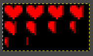
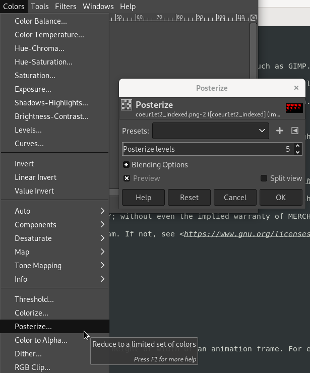
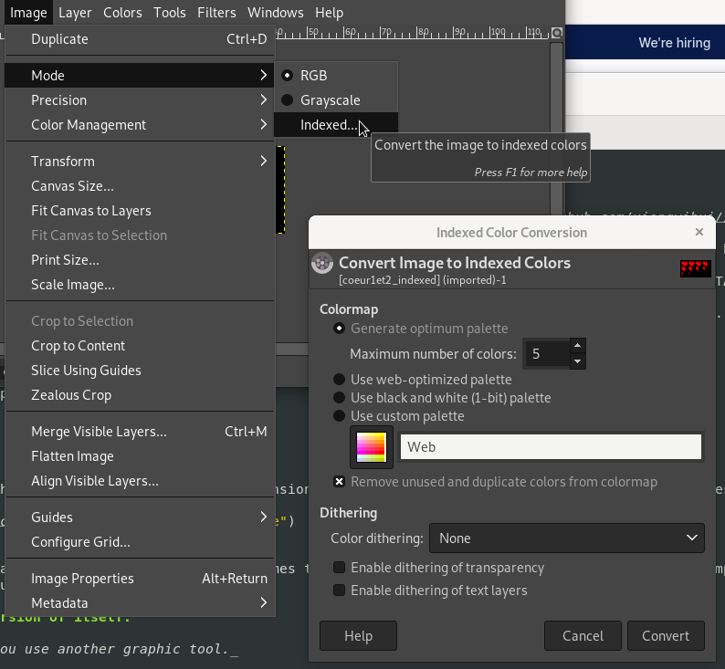
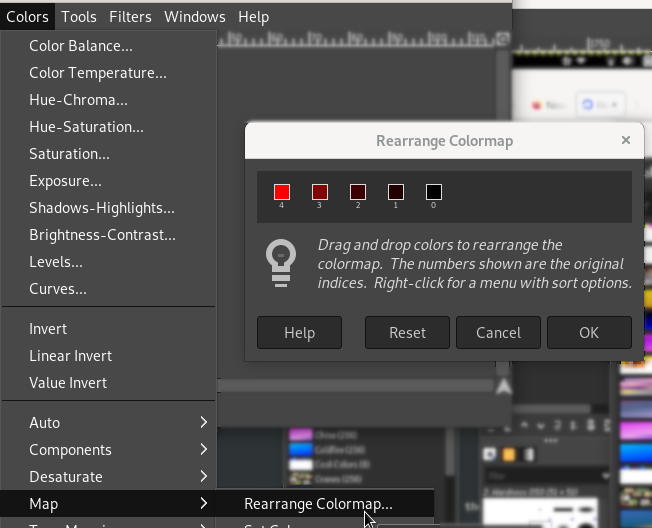

# Gif2c

This is a helper program for the [VidMax7219 Arduino LED panel display driver](https://github.com/mbrethes/vidmax7219).

It allows to generate C files containing image data suitable for the library, from GIF or PNG files generated by tools such as GIMP.

The files must use 5 indexed colors. Colors 0 - 3 correspond to 100% - 75% - 50% - 25% lit, and colors afterwards correspond to 0% lit.

The tool converts a single image or images into one, or several, C data structures representing 1 or several frames of an animation.

If you create an animation that contains several times exactly the same frame, the tool will optimize that.

At this point, the tool does not know how to handle GIF animations: you must make a flat GIF with all your frames, and specify height or width from
which to cut your animation.

## License

This program is (c) 2018-2022 by Mathieu Brèthes. It is based on public domain code by [xiongyihui](https://gist.github.com/xiongyihui/1106c5755a966753ba2f02e827879aed).

This program is free software: you can redistribute it and/or modify it under the terms of the GNU General Public License as published by the Free Software Foundation, either version 3 of the License, or (at your option) any later version.

This program is distributed in the hope that it will be useful, but WITHOUT ANY WARRANTY; without even the implied warranty of MERCHANTABILITY or FITNESS FOR A PARTICULAR PURPOSE. See the GNU General Public License for more details.

You should have received a copy of the GNU General Public License along with this program. If not, see <https://www.gnu.org/licenses/>. 

## Dependencies

- Python 3
- The Python Imaging Library (sudo apt install python3-pil in Debian)

# HOWTO

## 1. Create your animation / image

Create a pixellated image in PNG format. Note that the VidMax7219 display's dimensions are 32*8px. Use 4 shades of the same color to describe the intensity, then use black as the background color.

If you want to create an animation, create a flat image that is going to be X times the height or width of an animation frame. For example, if you have a 8x8 image and you want a 4 frame animation,
create a 32x8 or 8x32 image. gif2c will later cut that image into frames.

## 2. Transform your image into a palettized version of itself.

_This tutorial uses the Gimp, please adapt if you use another graphic tool._

* With The Gimp, you may want to first use the Posterize function to remove extra colors. Go to Color > Posterize and select 5 colors. If your picture has more than 5 colors, Posterize will try to group them to the closest ones.

  

* Then convert your image to an Indexed palette using Gimp's Image > Mode > Indexed... and create an optimum palette with 5 colors.

  

* Finally reorder your palette using the Colors > Map > Rearrange Colormap. Place your brightest color leftmost, and black rightmost, like so:

  

* You can now export your file as an indexed PNG or as a GIF.

## 3. Invoke gif2c.py

Let us assume that you made a 32x24 image, that you want to turn into a 3-frame 32x8 animation like below:

Open your favorite command-line tool and launch the program with the following command line:

    python3 gif2c.py example-pic.png myImage mycfile.c

This will generate a single 32x24 equivalent of your image divided into 4 subframes, and indexes containing a pointer to each single 32x24 subframe.

Now, to divide your image into animation frames, use the -h= switch and specify the height of your frame in pixels:

    python3 gif2c.py example-pic.png myImage -h=8 mycfile.c

Now mycfile.c will contain 3 images of size 32x8, with the first frame corresponding to the topmost part of your original image, the second the middle, the third the bottom. It
will also contain four index arrays pointing to each 3 pointers to the 3 32x8 frames.

_Alternatively, if you have divided your animation sequence horizontally, you can use the -w= switch instead to divide horizontally._

Finally, you can optimize your C import by importing all your images at the same time in the script:

    python3 gif2c.py example1.png myAnimation1 -h=8 example2.png myAnimation2 -w=8 example3.png myStaticImage mycfile.c
    
In that case, if several of your animations share identical frames, gif2c.py will detect them and generate index arrays pointing to a single frame instead of the copies.

You can then use the C file into your [VidMax7219](https://github.com/mbrethes/vidmax7219) project.

# TODO

- Explain data format (maybe in the driver instead?)
- Allow to use GIF animations

## Wishlist

- Add a graphical user interface
- Create a proper c _struct_ instead of those darn arrays
