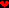

# Gif2c

This is a helper program for the [VidMax7219 Arduino LED panel display driver](https://github.com/mbrethes/vidmax7219).

It allows to generate C files containing image data suitable for the library, from GIF or PNG files generated by tools such as GIMP.

The files must use 5 indexed colors. Colors 0 - 3 correspond to 100% - 75% - 50% - 25% lit, and colors afterwards correspond to 0% lit.

The tool converts a single image or images into one, or several, C data structures representing 1 or several frames of an animation.

If you create an animation that contains several times exactly the same frame, the tool will optimize that.

At this point, the tool does not know how to handle GIF animations: you must make a flat GIF with all your frames, and specify height or width from
which to cut your animation.

## License

This program is (c) 2018-2022 by Mathieu Brèthes. It is based on public domain code by [xiongyihui](https://gist.github.com/xiongyihui/1106c5755a966753ba2f02e827879aed).

This program is free software: you can redistribute it and/or modify it under the terms of the GNU General Public License as published by the Free Software Foundation, either version 3 of the License, or (at your option) any later version.

This program is distributed in the hope that it will be useful, but WITHOUT ANY WARRANTY; without even the implied warranty of MERCHANTABILITY or FITNESS FOR A PARTICULAR PURPOSE. See the GNU General Public License for more details.

You should have received a copy of the [GNU General Public License](LICENSE) along with this program. If not, see <https://www.gnu.org/licenses/>. 

## Dependencies

- Python 3
- The Python Imaging Library (sudo apt install python3-pil in Debian)

# HOWTO

## 1. Create your animation / image

Create a pixellated image in PNG format. Note that the VidMax7219 display's dimensions are 32*8px. Use 4 shades of the same color to describe the intensity, then use black as the background color.

If you want to create an animation, create a flat image that is going to be X times the height or width of an animation frame. For example, if you have a 8x8 image and you want a 4 frame animation,
create a 32x8 or 8x32 image. gif2c will later cut that image into frames.

## 2. Transform your image into a palettized version of itself.

_This tutorial uses the Gimp, please adapt if you use another graphic tool._

* With The Gimp, you may want to first use the Posterize function to remove extra colors. Go to Color > Posterize and select 5 colors. If your picture has more than 5 colors, Posterize will try to group them to the closest ones.

  

* Then convert your image to an Indexed palette using Gimp's Image > Mode > Indexed... and create an optimum palette with 5 colors.

  

* Finally reorder your palette using the Colors > Map > Rearrange Colormap. Place your brightest color leftmost, and black rightmost, like so:

  

* You can now export your file as an indexed PNG or as a GIF.

## 3. Invoke gif2c.py

Let us assume that you made a 32x24 image, that you want to turn into a 3-frame 32x8 animation like below:

Open your favorite command-line tool. The program can be launched with a command line as simple as this:

    python3 gif2c.py example-pic.png myImage mycfile.c

This will generate a single 32x24 equivalent of your image, ready for use with VidMax7219 (a more detailed explanation of the generated format is in the next section).

But as you want to divide your image into animation frames, use the -h= switch and specify the height of your frame in pixels:

    python3 gif2c.py example-pic.png myImage -h=8 mycfile.c

Now mycfile.c will contain 3 images of size 32x8, with the first frame corresponding to the topmost part of your original image, the second the middle, the third the bottom.

_Alternatively, if you have divided your animation sequence horizontally, you can use the -w= switch instead to divide horizontally._

When you have several images and animations for your project, you can optimize your C import by importing all your images at the same time in the script:

    python3 gif2c.py example1.png myAnimation1 -h=8 example2.png myAnimation2 -w=8 example3.png myStaticImage mycfile.c
    
In that case, if several of your animations share identical frames, gif2c.py will detect them and remove the dopplegängers from the C file, thus saving space.

You can then use the C file into your [VidMax7219](https://github.com/mbrethes/vidmax7219) project.

# The generated C file in more detail

Let us invoke gif2c with this 9x8 pixel example image :

    python3 gif2c exampleImage.png myImage exampleImage.c

The generated data will look like [this](extra/exampleImage.c):

All the variables are prefixed with _myImage_, that you have defined above in the command line.

The first two lines contain information about the size of the image.

    static const byte myImage_x = 9;
    static const byte myImage_y = 8;

Then we get binary data. Each frame is divided into up to 4 "subframes" labelled a, b, c, and d. They will be used by VidMax7219's image display functions.
The subframes are necessary to handle the five intensities allowed by the driver (0%,25%,50%,75%,100%).
This image data is stored in PROGMEM, that means, it does not use RAM on your Arduino.

The frame names also contains numbers: myImage_Z_T

* Z is the frame number in your animation, starting from 0, if your image is divided into frames using the X axis
* T is the frame number in your animation, starting from 0, if your image is divided into frames using the Y axis

Each pixel is represented in each subframe by a single bit, with 1 indicating VidMax7219 to turn a led on, and 0 to turn it off.
When a pixel is set to 1 in all of the 4 subframes, it will be on 100% of the time (maximum display intensity). When it is 0 in all the
subrames, it will be off (LED off). The intensity is then the sum of the bits at coordinates x-y in each subframe.

Each line of the array corresponds to a line in the picture. If the X coordinates of your image is not a multiple of 8, then the
last byte of the array is padded with 0s.

If gif2c detects that some subframes are identical, the duplicates will be removed, so you may not always have a, b, c and d subframes.

    static const PROGMEM byte myImage_0_0_a[] = {
    0b10011100, 0b10000000, 
    0b01111111, 0b00000000, 
    0b11110111, 0b10000000, 
    0b11111111, 0b10000000, 
    0b01111111, 0b00000000, 
    0b10111110, 0b10000000, 
    0b11011101, 0b10000000, 
    0b11101011, 0b10000000, 
    }; 
        
    static const PROGMEM byte myImage_0_0_b[] = {
    0b01100011, 0b00000000, 
    0b11100011, 0b10000000, 
    0b11111111, 0b10000000, 
    0b11110111, 0b10000000, 
    0b11111111, 0b10000000, 
    0b01111111, 0b00000000, 
    0b00101010, 0b00000000, 
    0b00010100, 0b00000000, 
    }; 
    static const PROGMEM byte myImage_0_0_c[] = {
    0b00000000, 0b00000000, 
    0b01110111, 0b00000000, 
    0b11110111, 0b10000000, 
    0b11111111, 0b10000000, 
    0b01111111, 0b00000000, 
    0b00111110, 0b00000000, 
    0b00011100, 0b00000000, 
    0b00001000, 0b00000000, 
    }; 
    static const PROGMEM byte myImage_0_0_d[] = {
    0b01100011, 0b00000000, 
    0b11110111, 0b10000000, 
    0b11111111, 0b10000000, 
    0b11111111, 0b10000000, 
    0b11111111, 0b10000000, 
    0b01111111, 0b00000000, 
    0b00111110, 0b00000000, 
    0b00011100, 0b00000000, 
    }; 

Finally you get more information about the data: this is the length of your animation in number of frames,

    static const int myImage_alength = 1;

And those four arrays are the most important part, since those are what you are going to pass as parameters to VidMax7219 functions.
These arrays can be long if your animation is long, so they are also stored in PROGMEM.

They contain a sequence of references to the subframes to be used in order to display the image / the animation. You will always
have four of them, and they will always be named _myImage_\_names\_a, b, c, and d.

In the situation where gif2c has removed duplicate subframes, you are likely to find several times the same subframe in each array or
even in different arrays.

    static const PROGMEM byte* const myImage_names_a[] = {
    myImage_0_0_a};
    static const PROGMEM byte* const myImage_names_b[] = {
    myImage_0_0_b};
    static const PROGMEM byte* const myImage_names_c[] = {
    myImage_0_0_c};
    static const PROGMEM byte* const myImage_names_d[] = {
    myImage_0_0_d};

# TODO

- Allow to use GIF animations

## Wishlist

- Add a graphical user interface
- Create a proper c _struct_ instead of those darn arrays
